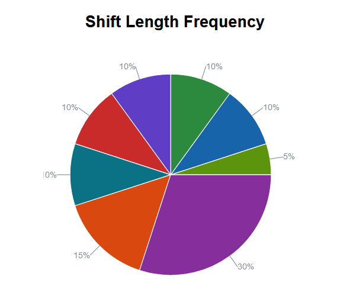

# Capstone Project #2

This is a simple web application that allows for quick and easy data visualization. It operates by reading a `.tsv` file, parsing the data by column, and then providing you options to select columns, run various analysis on them via a server-side api, and then display the results as responsive and easy to understand charts. For simplicity and speed, it is state-based and database free.

## Documentation

### File Structure

The `.tsv` file containing your data should be formatted in columns, with the top row functioning as headers.

### Column Data Types

Each column is parsed and assigned a data type. If no single data type is found in a column, then it is assigned the `string` type.

| Type     | Format           |
| -------- | ---------------- |
| `Number` | `Int` or `Float` |
| `Date`   | `YYYY-MM-DD`     |
| `String` | anything         |

### Analysis Options

#### Incidence-Over-X

Analyze the incidence count of items in column A over column B. Column B can either be a date or a time.

#### Frequency Analysis

Analyze the frequency of the data and display as either a histogram or pie chart.

Double Column Frequency: Select a column and then select one of the items that appears in it as well as a second column to derive intervals from. The occurrence of the selected item will be counted and mapped to each derived interval.

Single Column Frequency: Select a single column. The occurrence of each item or interval in that column will be counted.

#### Scatter Analysis

Multiple series: Select a column to derive the series from and select two columns to use as x and y axis. Each row will be a data point.

Single Series: Select just the x and y axis. Each row will be a data point.

